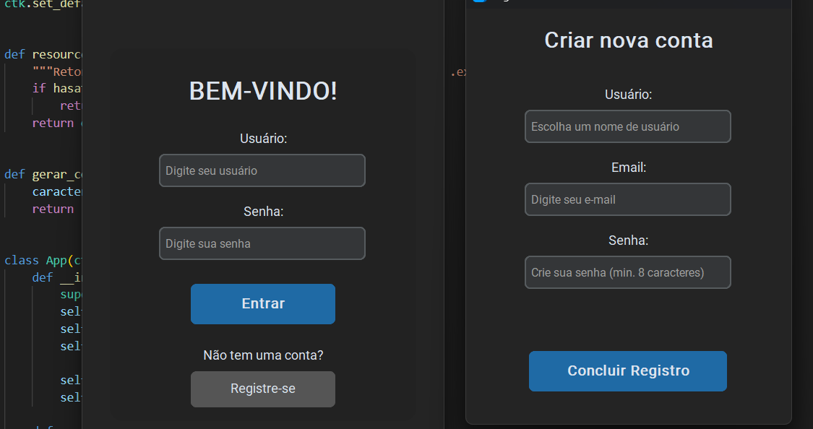

# 🧠 Sistema de Login com Dontpad Personalizado

Este é um sistema de login e registro de usuários feito em **Python**, com interface moderna utilizando **CustomTkinter**. Cada usuário, ao se registrar, recebe uma chave única criptografada. Essa chave é usada para redirecioná-lo automaticamente ao seu próprio bloco de anotações privado no site [dontpad.com](https://dontpad.com).

## 🚀 Funcionalidades

- Registro de novos usuários com validação de e-mail e senha.
- Login com verificação no banco de dados.
- Criação automática de uma URL única para cada usuário (`dontpad.com/<código_aleatório>`).
- Interface gráfica com CustomTkinter e imagem de fundo.
- Banco de dados SQLite3 integrado com **Peewee ORM**.

## 📂 Estrutura do Projeto

```
📁 projeto/
├── app.py           # Arquivo principal com a interface e lógica de login/registro
├── database.py      # Banco de dados e definição do modelo de usuário
├── usuarios.db      # Banco SQLite gerado automaticamente
└── foto_ceu.jpg     # Imagem de fundo da interface (adicione uma imagem com esse nome)
```

## ⚙️ Requisitos e Instalação

1. Clone o repositório:

```bash
git clone https://github.com/seuusuario/nome-do-repo.git
cd nome-do-repo
```

2. Instale as dependências:

```bash
pip install -r requirements.txt
```

## ▶️ Como Executar

Execute o arquivo principal:

```bash
python app.py
```

## 📌 Observações

- O sistema abrirá automaticamente o navegador com a URL única do usuário logado.
- A URL segue o formato: `https://dontpad.com/<código_aleatório>`, permitindo uma área de anotações exclusiva para cada usuário.
- A base de dados é criada localmente no arquivo `usuarios.db`.

## 🛡️ Segurança

> Este projeto é para fins educacionais. Não utiliza criptografia de senhas. Para produção, recomenda-se usar hashing seguro (como `bcrypt` ou `argon2`).

## 📸 Interface

>   


## 👨‍💻 Autor

Desenvolvido por Victor Anastacio( https://github.com/duvvic )&( https://www.instagram.com/anastaciopicoli )– Sinta-se livre para contribuir ou adaptar.
